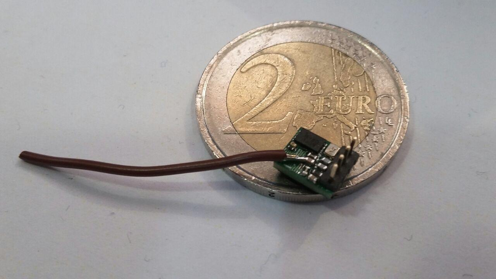

## ESP8266 SDK

[esp8266 project on github](https://github.com/esp8266/Arduino)




## ESP8266 Telemetry

With this firmware, you can use an ESP8266 WiFi module for telemetry in PaparazziUAV. At this moment, it works only as a client that connects to a Hotspot. For example, you can have the ESP module connect to the same router as your computer. Another option is to have a WiFi Dongle in the computer that is configured as a hotspot.

## Wiki

Module-specific documentation can be found in the [wiki](https://github.com/paparazzi/esp8266_udp_firmware/wiki).

## Required tools

- Download the latest stable Arduino IDE from the [Arduino website](http://www.arduino.cc/en/main/software).
- Enter ```http://arduino.esp8266.com/stable/package_esp8266com_index.json``` into *Additional Board Manager URLs* field. You can add multiple URLs, separating them with commas.
- Open Boards Manager from Tools > Board menu and install *esp8266* platform.

## Configuring the ESP
- Within the Arduino IDE, select your ESP8266 board from Tools > Board menu.
- Open `pprz_udp_link.ino`. There should also be a tab with `wifi_config.h`.
- In `wifi_config.h`, configure the settings of the hotspot you want to connect to.
- Also change the broadcastIP to the broadcast IP in your network. In Linux, you should be able to discover this by executing `ifconfig`. Look for `Bcast:*.*.*.*` for the wireless network interface (something like wlan*).
- Upload the firmware to your ESP8266 by pressing the upload button.

## Configuring PPRZ
In your airframe file, put the following configuration within the `<firmware>` section:
```
<subsystem name="telemetry" type="transparent">
  <configure name="MODEM_BAUD" value="B115200"/>
  <configure name="MODEM_PORT" value="UART1"/>
</subsystem>
```
If you are using a different serial port, change `UART1` accordingly.

## Connecting the module
- Connect VCC and GND to the ESP8266. The module runs on **3.3V**, don't put 5V on it!

| ESP8266 | Autopilot |
| --- | --- |
| VCC | 3.3V |
| GND | GND |
| RX | TX |
| TX | RX |

## Fire up the groundstation
- Start Paparazzi Center. Select Tools > Data Link.
- Replace the command line options with "~/paparazzi/sw/ground_segment/tmtc/link  **-udp**".
- Enjoy telemetry!

## Documentation


## Suggestions for improvement

Instead of flashing the module with a fixed SSID and password, it would be nice to have this configurable from the autopilot. Upon startup, the ESP8266 could send out requests for the SSID and password. A module within PPRZ could react by providing this in a PPRZ message format.
