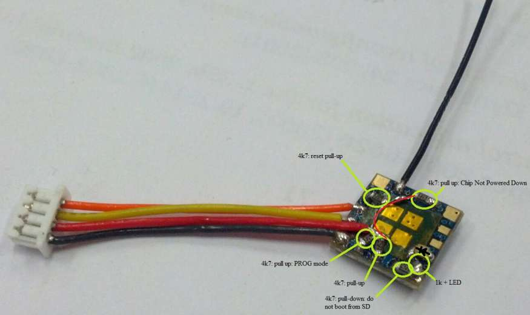
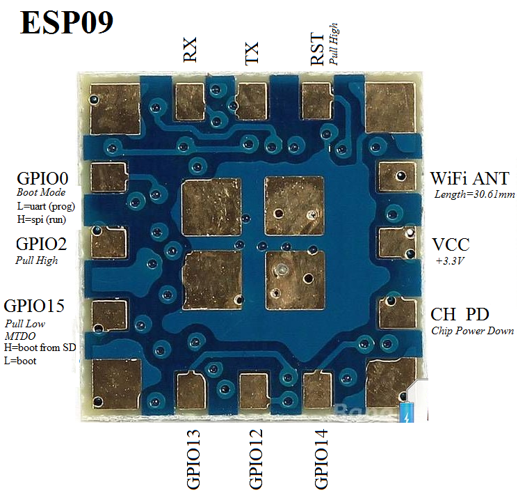
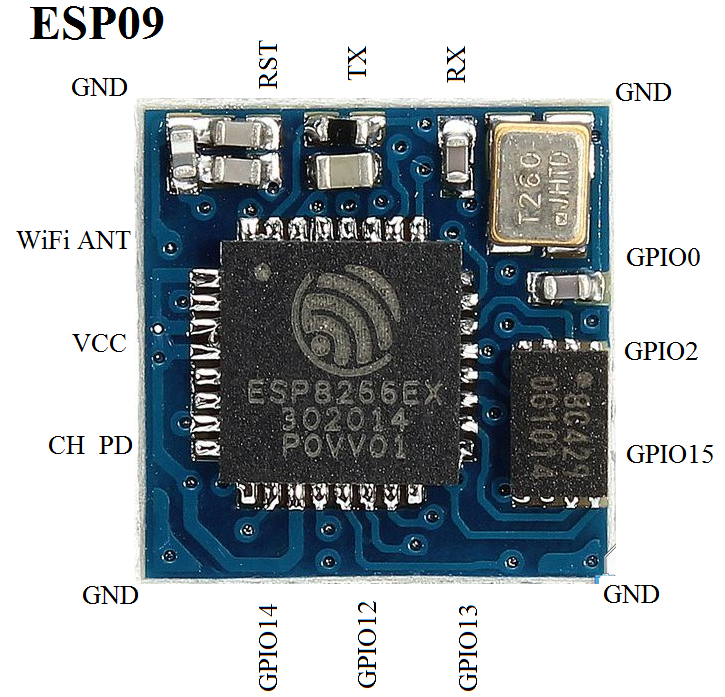
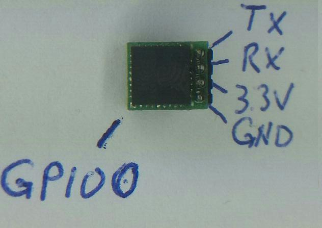
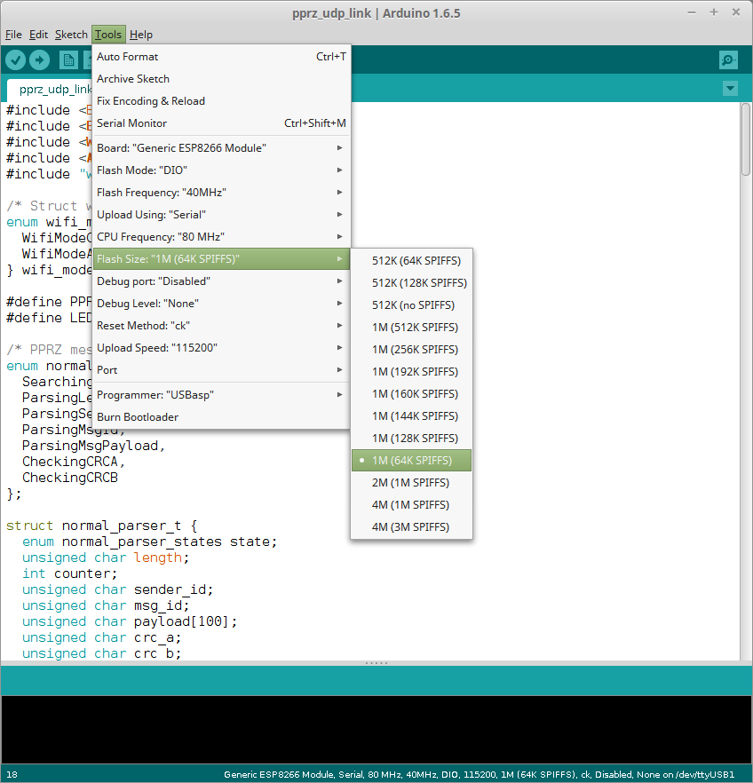

# About

With this firmware, you can use an ESP8266 WiFi module for telemetry icw a UAS that runs Paparazzi autopilot code. To connect there are two option. The frist is that the module can work as a client that connects to a Hotspot. For example, you can have the ESP module connect to the a same router as your computer. The second option is to set it up as a Router itself, then just connect your PC to this module, just select SSID you gave it.

# BOM

To make the modification one nees some 0402 SMD components:

- 5x 4k7 Resistor
- 1x 1k  Resistor
- 1x     Blue LED 

# Building

To create the module just buy a regular ESP09 module, available from many suppliers.




## Pinouts



## Pico-ESP
There is also an very light and minimum sized Pico-ESP, developed at the MAVLab TUDelft. This module runs the very same software.


# Tools 

Installationthe following: 

- Download the latest stable Arduino IDE from the [Arduino website](http://www.arduino.cc/en/main/software). We used the Linux 64 version with good success.
- Enter ```http://arduino.esp8266.com/stable/package_esp8266com_index.json``` into *Additional Board Manager URLs* field. You can add multiple URLs, separating them with commas. You can find it under menu  item File -> Preferences -> Settings
- Open Boards Manager from Tools -> Board menu and install *esp8266* platform.

# Configure
Configuring the ESP

- Within the Arduino IDE, select your ESP8266 board from Tools -> Board menu.
- Open `pprz_udp_link.ino`. There should also be a tab with `wifi_config.h`.
- In `wifi_config.h`, configure the settings of the hotspot you want to connect to.
- Also change the broadcastIP to the broadcast IP in your network. In Linux, you should be able to discover this by executing `ifconfig`. Look for `Bcast:*.*.*.*` for the wireless network interface (something like wlan*).

# Flashing

Basically:
- Upload the firmware to your ESP8266 by pressing the upload button.

But it needs to be in bootloader mode.. You have to connect GND with GPIO0 _while_ applying power!

## Flashing the firmware UART

The very first time, or if things are screwed up, the firmware needs to be flashed to the pico-esp using UART. Use a **3.3V** USB-to-Serial cable and connect Tx->Rx, Rx->Tx, Gnd->Gnd. 

It is usually better to use an external power source for the 3.3V. The 3.3V USB-to-Serial cables have only 3.3V on Rx and Tx, 
**the VCC is still 5V from USB which will damage your ESP**

### Pico ESP
To get the pico-esp in boot-mode, you have to connect GND with GPIO0 _while_ applying power. GPIO0 has no pin on the pico-esp, but just a very small patch at one corner.



When the Pico-ESP is in boot mode, the firmware can be flashed from the Arduino-IDE. See [README.md](https://github.com/paparazzi/esp8266_udp_firmware/blob/master/README.md) for instructions on getting the IDE. Use the following configuration for flashing.



## Updating firmware Over-The-Air

The firmware can be updated over WiFi. This should performed with care!. It is **crucial** to configure the WiFi correctly in the new firmware, otherwise you will not be able to establish a connection with the ESP and you will need to reprogram it over UART.

To update over the air, first you need a firmware image. In the Arduino-IDE, this can be generated from the menu Sketch->Export compiled Binary. This generates a binary image in the folder of the sketch.

In _Client_ mode, the Pico-ESP connects to a router. If your computer is connected to the same network, you can upload the firmware with the following command. This command contains the link to the **espota.py** tool which is part of the ESP Arduino package. The directory might be different on your system. Also update the path to the binary.

`python ~/.arduino15/packages/esp8266/hardware/esp8266/2.1.0/tools/espota.py -i esp-module.local -r -f ~/git/esp8266_udp_firmware/pprz_udp_link/pprz_udp_link.cpp.generic.bin`

If you have configured the Pico-ESP in _AccesPoint_ mode, you can connect to the pico-esp with a laptop. The command is slightly different, since it now contains the IP of the module:

`python ~/.arduino15/packages/esp8266/hardware/esp8266/2.1.0/tools/espota.py -i 192.168.4.1 -r -f ~/git/esp8266_udp_firmware/pprz_udp_link/pprz_udp_link.cpp.generic.bin`

# Airframe
In your airframe file, put the following configuration within the main AP`<firmware>` section:

```
<subsystem name="telemetry" type="transparent">
  <configure name="MODEM_BAUD" value="B115200"/>
  <configure name="MODEM_PORT" value="UART1"/>
</subsystem>
```
If you are using a different serial port on you autopilot board, change `UART1` accordingly.

# Connecting

WARNING: The module runs on **3.3V**, don't put 5V on it, 5V will destroy you board

To connect the module to your AP board:

- Connect VCC and GND, RX to TX, and TX to RX of the ESP09 board 

| ESP8266 | Autopilot |
| --- | --- |
| VCC | 3.3V |
| GND | GND |
| RX | TX |
| TX | RX |

# Testing

- Connect to you SSID of the module or let it connect to your router
- Start Paparazzi Center
- Select Tools -> Data Link
- Stop link
- Replace the command line options with "~/paparazzi/sw/ground_segment/tmtc/link **-udp**".
- Press [REDO] to restart link with the new parameters
- Wait a second...
- Enjoy telemetry over Wifi with Paparazzi

TIP: Data Messages can be simply viewed also with the.. message tool, see the Paparazzi Center tools menu.

# Documentation

Well, yes it is a opensource wiki and project. If you feel something is lacking, please add it, TIA

# Suggestions for improvement

Instead of flashing the module with a fixed SSID and password, it would be nice to have this configurable from the autopilot. Upon startup, the ESP8266 could send out requests for the SSID and password. A module within PPRZ could react by providing this in a PPRZ message format.

# Links

For more information also take a look at

- This [ESP8266 SDK project on github](https://github.com/esp8266/Arduino)
- Information about the ESP8266 chip and arduino tools: [esp8266 wiki](https://github.com/esp8266/esp8266-wiki/wiki)
